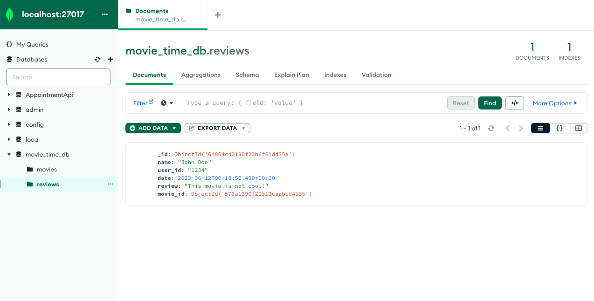
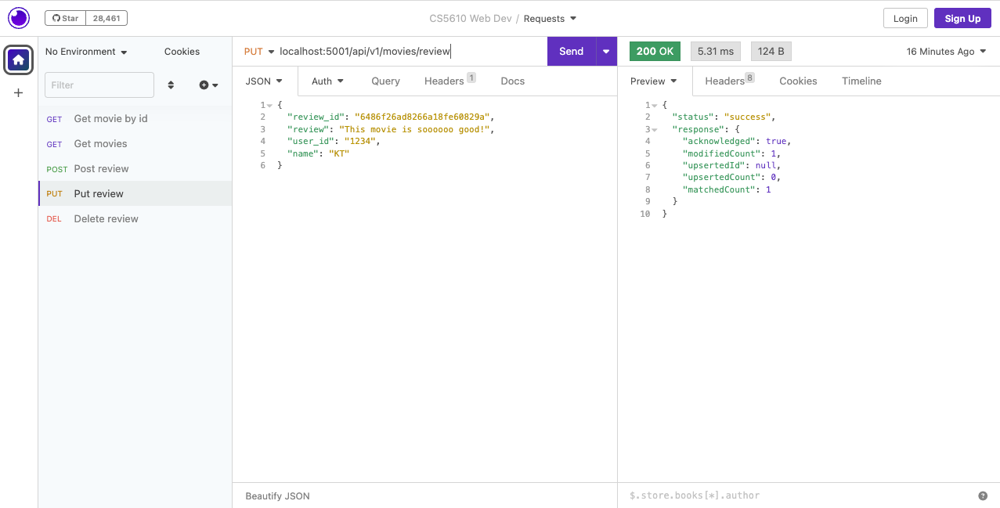
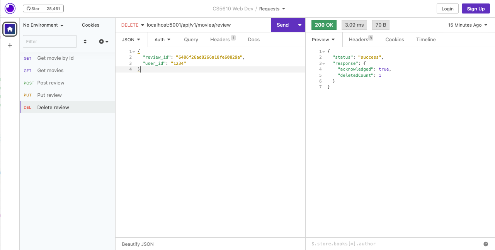
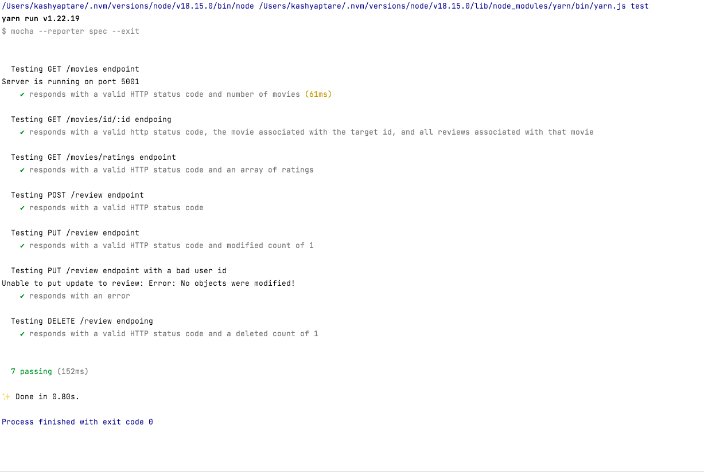
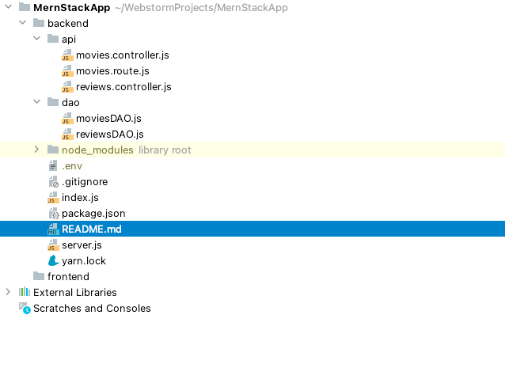
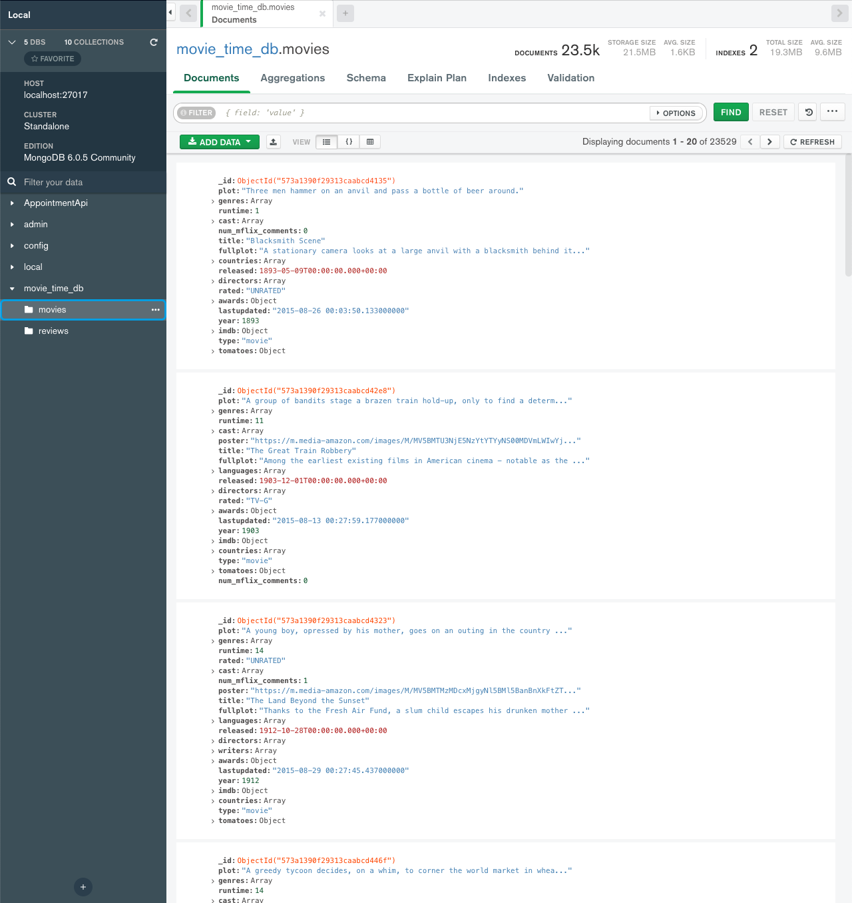

# Mern Project part 2

---

### Tasks achieved:
> Added backend functionality to start the app, expose the server, and set up its routes. Those routes will handle 
> requests and send them to the correct controller methods. The controller methods will invoke the respective DAO 
> methods.  
> Added testing for all backend functionality.

### A screenshot of the Compass interface with a review added

### A screenshot of the Insomnia interface with a successful response for both the PUT and DELETE requests.

  
  

### Screenshot of all passing tests

---

# Mern Project part 1

---

### Tasks achieved:

> Added the api, and dao directories and the base javascript files within them that will house the backend portion of
> the overall project.

### Screenshot of the project file tree

### Screenshot of the collections in MongoDB

